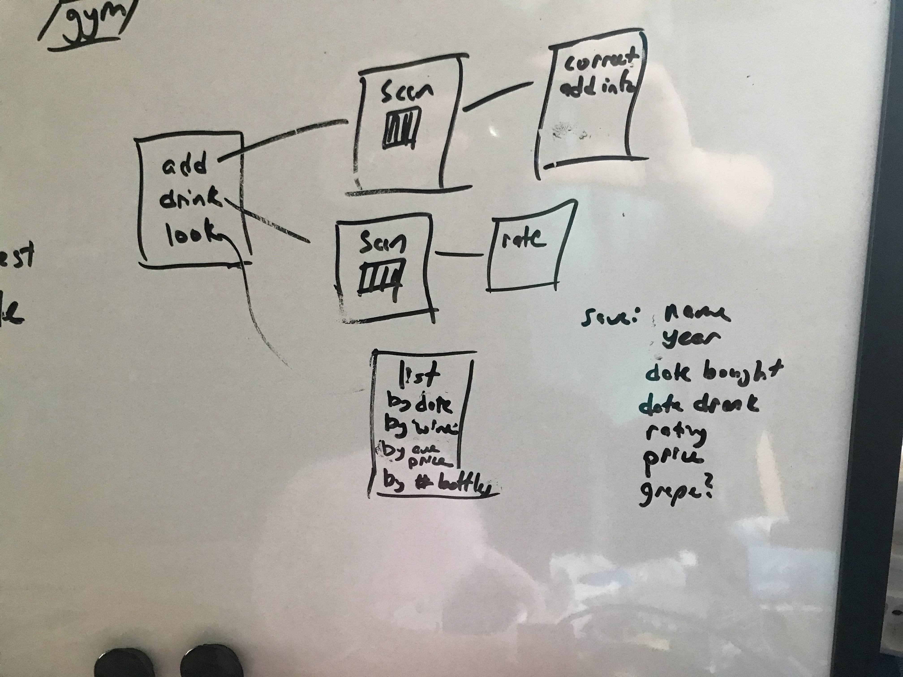

# 100 Days Of Code - Log

**I want to learn**: Swift, pytorch

**I want to get more practice with** tensorflow, front end development

**I will do for fun/for a break** Advent of code, hackerrank, Project Euler 100

**possible projects**:

turn python code I have for reading in french webpage and creating a list of translations for words I don't know into an iOS app

Make a 100 days of app to track work

### R1D1: Jan 13, 2020 

**Today's Progress**: Breaking the rules already -- I worked through a Swift tutorial and am in the process of making my very first app.  Since I have no experience at all in Swift, I'm counting tutorial work for the first few days.  I'm following https://www.raywenderlich.com/4919757-your-first-ios-and-swiftui-app/ 

**Thoughts:** So far Swift is pretty easy to learn.  There's a lot in common with python and html, so that helps.  I'm making good progress

**Link to work:** https://github.com/alyshareinard/firstswiftapp

### R1D2: Jan 14, 2020 

**Today's Progress**: I completed the "bullseye" Swift tutorial put a working bullseye App on my phone! Even better, though, I created my own app.  My son was practicing his times tables and he likes to see the numbers instead of hearing them -- so I made an app that lets him do just that. Had to spend lots of time on stackoverflow and google, but managed to put it together. It's an MVP now -- barebones, but works.  He likes it and we both have ideas for improving it.  

**Thoughts:** Yay!  My first app of my very own!

**Link to work:** https://github.com/alyshareinard/timestable

### R1D3: Jan 15, 2020 

**Today's Progress**: Working through some details of the Times table app -- resizing the answer box, adjusting the layout.  Made my own numpad since the built in one doesn't have a "done" button and so permanately blocks several of my buttons.  Added ability to keep track of and display points.  Also made planning list and did a little research for a wine inventory app my sister-in-law requested. 

**Thoughts:** The Swift number pad keyboard really needs a "return" or "done" button!  WTH?  

**Link to work:** https://github.com/alyshareinard/timestable

### R1D4: Jan 16, 2020 

**Today's Progress**: My times table app had been picking numbers randomly from a given range, but this results in the user seeing some equations repeatedly and not seeing other equations -- so today I set up arrays for num1, num2 that contain the desired range of numbers to practice and then set up a 2d (shuffled) problems array of the form [ [num1, num2, num1*num2], ]  With this the code now removes problems that are answered correctly on the first try.  The problems array has to be set up when the start button is pushed and I don't have a good way to handle the end of play when there are no problems left. So that's my next job.  I'm now working through some tutorials to get a better handle on creating multiple screens for the start and finish parts of the app.  

**Thoughts:** Working through bugs/issues on my own (with the help of google and stack overflow) as I develop this app has been very helpful, but at this point it's time to go back to tutorials for a bit to pick up some more fundamentals.  

**Link to work:** https://github.com/alyshareinard/timestable

### R1D5: Jan 17, 2020 

**Today's Progress**:  Today I focused on fundamentals -- working through 100 days of SwiftUI (https://www.hackingwithswift.com/100/swiftui) -- jumping through the first few days to fill out the knowledge I have so far. Learned about ternary operators -- that's what those ?'s are for! -- got a fuller understanding of function syntax, and starting a dive into closures -- closures are a new concept for me, and are important in Swift so I'll have to spend some time on them.  More fundamentals tomorrow and hopefully I'll be able to start implementing some of my learnings into my projects.  

**Thoughts:** I'm familiar with the concept of passing functions to functions, but I haven't really done it -- closures seem like that on speed and actually important in this language, so I have some grokking to do.  

**Link to work:** https://www.hackingwithswift.com/100/swiftui completed day 1-5

### R1D6: Jan 18, 2020 

**Today's Progress**: Not much to report today.  Really had just an hour so worked through day 6 and part of day 7, really getting a handle on closures. Also read an article about making a menu in Swift.  That will be helpful for making the timestable app more customizable.  

**Thoughts:** I'm getting closures -- hopeffuly I'll have time tomorrow to finish day 7 of the tutorial and look through some code examples to get a better feel for how closures are used in practice.  

**Link to work:** https://www.hackingwithswift.com/100/swiftui completed day 6 - 7.5

### R1D7: Jan 19, 2020 

**Today's Progress**: Worked through the rest of the tutorial on closures and blew through the 2 days on Structures -- there was quite a bit in common with python structures, so it wasn't too hard. Looked through my own code examples with my new knowledge, which helped me interpret a few parts. Read up on codebase. Started playing with an implementation of a barcode reader, but I think I still need more background information about what the different files in the swiftui project folder do and how they interact.

**Thoughts:** Closures are less daunting, structure are great -- I like being able to put a function into a structure. Very powerful.   

**Link to work:** https://www.hackingwithswift.com/100/swiftui completed day 7.5-9

### R1D8: Jan 20, 2020 

**Today's Progress**: Added a timer to the Times tables app -- timer counts up and gives more points the faster the problem is solved.  It's nice to do some real project coding again.  Then on to more tutorials.  Classes, protocols, extensions, optionals.  All helping to clarify what I have seen in sample swift code.  Good stuff!  I like that on hackingwithswift they have videos and text explaining each point. I don't like to watch videos so I really appreciate the text! Then went through and created a couple of projects on the swiftui in 100 days page.  Ran into app developer limit for free account but found out how to delete apps from my phone using Window, devices and simulators, then deleting apps from my phone on there to make room for new ones.  

**Thoughts:**  The tutorials and sample projects are a big help -- I have a better udnerstanding of how the different elements in ContentView work together.  I'm looking forward to a tutorial project that uses multiple app pages and/or uses some of the other files in the main project folder.  
I wonder if I should get a developer account -- not yet, but maybe soon. 

**Link to work:** https://www.hackingwithswift.com/100/swiftui completed day 10-12, 16-22.

### R1D9: Jan 21, 2020 

**Today's Progress**: Feeling under the weather but put my hour in -- worked through hacking with swift project and looked at a few swift practice sites.  In the Hacking With Swift there was a nice overview of the grid method -- I'll add that to my tiems table app tomorrow -- I am finding that the number keys don't line up on the ipad, so a grid might help.  

**Thoughts:**  Tired, but feeling good about completing my hour of coding.  

**Link to work:** https://www.hackingwithswift.com/100/swiftui completed day 23-25.5, checked out https://edabit.com/ for code practicing -- not a bad interface, but a bit slow.  

### R1D10: Jan 22, 2020 

**Today's Progress**: Did the day 25 project (no code provided) creating a roshambo brain buster game.  Was able to put it together easily.  Then going to the next day it required core ML -- I have Apple Mojave and I'm reluctant to upgrade to Catalina, so that's causing some problems.  My Xcode 11.3 verson of core ML requires Catalina. 

**Thoughts:**  Will I have to upgrade my os?  Ugh.  

**Link to work:** https://www.hackingwithswift.com/100/swiftui day 25 project -- creating a Rock paper scissors brain builder game from scratch.   https://github.com/alyshareinard/roshambo

### R1D11: Jan 23, 2020 

**Today's Progress**: trying to get core ML to work I uninstalled Xcode, installed Xcode10.3. But then swiftUI didn't work,s o I upgraded again and skipped the core ML project for now...  Learned about animations -- really useful stuff! Projects 5 & 6 Day 29-34

**Thoughts:** 

**Link to work:** https://www.hackingwithswift.com/100/swiftui 

### R1D12: Jan 24, 2020 

**Today's Progress**: Project 7, day 36-38, hacking with swift -- learned about creating multiple views and passing values back and forth between views, also how to save data that is reloaded when app is reopened. Looked at day 35 -- challenge is times table app like the one I started with!  LOL. 

**Thoughts:** 

**Link to work:** https://www.hackingwithswift.com/100/swiftui 

### R1D13: Jan 25, 2020 

**Today's Progress**: And now for something completely different.  Attended the Applied Machine Learning Days workshops.  Learned how to use machine learning in python to write browser extensions (specifically for ad blocking) got a bit of info on the scikit-mobility module that uses dataframes to interact with mobility data of individual people (cell phone data) or groups of people. Then attended a pytorch tutorial which helped me get accustomed to pytorch syntax.

**Thoughts:** AMLDs is great.  

**Link to work:** https://github.com/theevann/amld-pytorch-workshop, https://github.com/scikit-mobility/scikit-mobility

### R1D14: Jan 26, 2020 

**Today's Progress**: More AMLD -- spent the day learning about reinforcement learning and coding a "drone" to fly through "skyscrapers" to deliver packages -- they also needed to know when to visit a recharge station.  Learned a lot and enjoyed teh challenge

**Thoughts:** AMLDs is great.  

**Link to work:** https://github.com/pacm/rl-workshop

### R1D15: Jan 27, 2020 

**Today's Progress**: While I'm taking a break from swift, I decided to get started on the fastAI course -- I did most of this course 3-4 years ago, but they've updated it and I want to refresh my knowledge.  I decided to set things up on colab for now -- my weekend at the AMLD workshops was spent using colab extensively and I think it works pretty well.  I watched the first lesson and set the notebooks up on a Jetson Tx2 in November when I was working for a hardware startup, so for now I have just run through the first lesson again on colab and did some related reading.  

**Thoughts:** 

**Link to work:** https://github.com/pacm/rl-workshop

### R1D16: Jan 28, 2020 

**Today's Progress**: Back to Swift, day 39-42 -- an app that provides information about the Apollo missions.  Includes separate screens for each mission/astronaut and a menu that is used to pull up those screens. Also included separate files the mission and astronaut structures and a file to decode the json files used as inputs -- oh, and I learned to add json files to a project and load them in.  Lots of stuff today! 

**Thoughts:** I'm still not completely clear on the different files and when they're used, but I'm getting closer

**Link to work:** https://www.hackingwithswift.com/100/swiftui 

### R1D16: Jan 29, 2020 

**Today's Progress**: Went back to AMLDs and talked to the people behind the GIOTTO codebase about working with their software and contributing.  Definitely a step forward, but I didn't actually write or run any code, so I'm not counting today.   

**Thoughts:** Working with Giotto sounds great!

**Link to work:** https://www.giotto.ai/   https://github.com/giotto-ai/giotto-tda

### R1D17: Jan 30, 2020 

**Today's Progress**: Spent a lot of time tooling around github and finding great resources to work with in python, deep learning, machine learning, interview questions, ios, web development -- I need to collate this information and determine priorities.  In order not to miss another day of real coding, I worked a bit more on the times table app, adding a rest button and starting to make a screen to let the player select the times table(s) that they want to work on. The app is broken now, but I have to get to some home stuff -- hopefully I can fix it tomorrow.    

Did the first two challenges in http://www.pythonchallenge.com/ -- fun puzzles

**Thoughts:** I thought I'd have an easy time making modifications to my app, but I'm still climbing the learning curve!

**Link to work:** http://www.pythonchallenge.com/ challenge 1 and 2

### R1D18: Jan 31, 2020 

**Today's Progress**: Worked through the github resources, did a lot of reading, a bit frenetic -- reading up on Django, Giotto, etc.  Played a bit with my Swift programs

**Thoughts:** Forgot to add a log entry Friday and I'm not clear on what I actually did!  Need to be better about logging my days.  

**Link to work:** 

### R1D19: Feb 1, 2020 

**Today's Progress**: Went through making flashcards for python-- things I should know.  Iterators and generators -- I use them all the time, but didn't have the terms connected to ideas/usages.      

**Thoughts:** Terminology isn't too exciting, but it's important to be able to converse with programmers.  

**Link to work:** 

### R1D20: Feb 2, 2020 

**Today's Progress**: More python/data science terminology. Then worked on my times table app some more -- I have the two views working now, but I'm running into "can't use mutating member on immutable value" errors when I have selectable buttons that allow the user to select which times tables they want to work on.  Also don't have the syntax right for passing those values on to the game view.  More research/trail-and-error is necessary.

**Thoughts:** Lots to learn!

**Link to work:** https://github.com/alyshareinard/timestable

### R1D21: Feb 3, 2020 

**Today's Progress**: When back to hacking with swift days 36-38 to better understand how to pass variables around.  I need to get a better handle on how classes work in Swift. It's good (but painful) to work through this on my own to really understand it.  Not a lot of time today.  Hopefully I'll get this worked out tomorrow. 

**Thoughts:** Lots to learn!

**Link to work:** https://github.com/alyshareinard/timestable

### R1D22: Feb 4, 2020 

**Today's Progress**: Okay -- I'm getting the handle of passing variables in Swift.  I created a class to store the global variable (options) that contains "vals" which are the times tables the user wants to study.  I am able to modify that using buttons (right now two rows of 6 buttons each created separately -- a future task is to change that to a couple Foreach loops. Todo tomorrow: pass that array to the game part, make the buttons shade when selected

**Thoughts:** Making progress!

**Link to work:** https://github.com/alyshareinard/timestable

### R1D23: Feb 5, 2020 

**Today's Progress**: Passed a class between views! Woo-hoo!  Made number buttons color when they're selected and pass those numbers on to the game view where the multiplication problems are created.  Also made an alert that comes up with the final score when the last problem is solved.  Another MVP.  Need to work on making it look pretty, but functionality is all there.  

**Thoughts:** Feeling good!  

**Link to work:** https://github.com/alyshareinard/timestable

### R1D24: Feb 6, 2020 

**Today's Progress**: Something different today -- I've been obsessed by the coronavirus news and I saw that someone had uploaded the data to Kaggle.  I played around with an existing kernel and then I created my own kernel!  First time I've submitted anything publicly!  I'd been interested in how the number of deaths looks versus the recoveries with different delays.  Fun stuff! 
**Thoughts:** I guess I'm a kaggler now?  

**Link to work:** https://www.kaggle.com/alyshareinard/coronavirus-animated-over-time-updated-lat-lons
https://www.kaggle.com/alyshareinard/looking-at-deaths-vs-recoveries

### R1D25: Feb 7, 2020 

**Today's Progress**: Back to hacking with swift -- days 43-46 -- lots of practice with drawing.  Nice examples that I have all in one file. Tomorrow or later today I'll go back and create different views for each example.  Good stuff here. 

**Thoughts:** IOS drawing is nice and powerful.  

**Link to work:** https://github.com/alyshareinard/drawing

### R1D26: Feb 8, 2020 

**Today's Progress**: I learned how to use tabview and used it to put the drawing examples all in one app to show off the different techniques (and make it easier to refer back to them when I need to).  Also working through day 47 and read the challenge problem for day 48.  

**Thoughts:** https://www.hackingwithswift.com/guide/ios-swiftui/4/2/key-points -- has really a really important summary of classes vs structs and how the code uses them.  Also some info on user defined data. Worth rereading a few times!

**Link to work:** https://github.com/alyshareinard/drawing

### R1D27: Feb 9, 2020 

**Today's Progress**: Not feeling it today -- but didn't want to lost my streak so I did a few regex exercises on hackerrank.  

**Thoughts:** Low day today -- onward and upward tomorrow!

**Link to work:** 

### R1D27: Feb 10, 2020 

**Today's Progress**: Not feeling it today -- but didn't want to lost my streak so I did a few regex exercises on hackerrank.  

**Thoughts:** Low day today -- onward and upward tomorrow!

**Link to work:**

(Note, Feb 20 -- I have not been updating this, so I'm catching up today.)
### R1D28: Feb 11, 2020 

**Today's Progress**: Lots of data science review, reviewing my old projects for video interview

**Thoughts:** 

**Link to work:**

### R1D29: Feb 12, 2020 - R1D34 Feb 17, 2020

**Today's Progress**: working on project for hands on task

**Thoughts:** Learned a lot about Jupyter notebook, visualizations, pandas groupby, etc.  Feeling good

**Link to work:** https://github.com/alyshareinard/one_offs/blob/master/Proton%20project-FInal.ipynb

### -: Feb 18, 2020 - Feb 20, 2020

**Today's Progress**: Kids on vacation, stomach flu going around, not too productive.

**Thoughts:** 
**Link to work:** 

### R1D35: Feb 21, 2020

**Today's Progress**: Back to Swift -- learned how to use CoreData

**Thoughts:** Powerful stuff -- if I'm going to make some nice apps, I need to be able to save the data and CoreData is the way to do it.  It seems pretty easy in concept, though all the piece that need to be kept track of are something I'll have to get better at.  

**Link to work:** https://github.com/alyshareinard/Bookworm

### -----: Feb 22 - March 1, 2020

**Today's Progress**: I am realizing today (Feb 26) that I've been overwhelmed with things I "should" do and have been scattered in my work -- doing a bit of swift, a bit of playing on kaggle, a bit of reading on python, but without having nice snippets to report here.  I'm going to take a pause until Monday, try to make some order of things and come up with a plan to proceed -- then I'll recommit to the 100 days of code.  

**Thoughts:** 1/3 of the way through, time to take a breather and refactor my brain.  

**Link to work:** To come!

Okay, I spent some time evaluating my priorities and decided that I need to switch to a project centered focus.  So I identified 3 categories of projects and one project in each to work on.  On a 2-4 week basis I'll evalute the projects I'm working on and decide whether to move on to a new project.  (The plan is that in 2 weeks I'll evaluate and move on if it makes sense, but in 4 weeks the assumption will be that I move on to the next thing -- the plan is, of course, subject to change.)  So the projects are:

Swift: Making a wine inventory (Wine-ventory) app for my sister-in-law.  This will involve multiple screens, data that needs to be saved between screens and between uses (using core data), integrating a bar code reader with screen inputs, testing and polish.  I'm estimating that it will take a month.  

Machine learning: this category will mostly focus on Kaggle projects for now -- to start will I'll work with the TMDB box office prediction challenge (https://www.kaggle.com/c/tmdb-box-office-prediction/overview).  The idea is that I'll work on my own, do an EDA and some modeling, then I'll look at other kernels and see what other people have done and try to replicate it (rule: no copy and pasting code! I can recreate it line by line if I need to/want to but I'll have to type it).  

New software: Learning the Giotto package.  I've been wanting to work on this since I talked to a few people on this team at AMLDs. I did a project several years ago that is exactly along the lines of what their software is set up to do, so I want to learn the software and try to replicate my old project.  I'll start by installing the code and going through their tutorial, then I'll bring in my own data.  

### R1D36: March 2, 2020

**Today's Progress**: I sketched out the screens needed for the Wine-ventory app and what data should be saved.  I started working with the box office challenge -- I have the data in a structure and I'm working through the different fields. I made the "webpage" column True/False and now I'm thinking about what to do with the cast and crew columns -- both contain lists of dictionaries.  A given person is in a most 50 films as a crew member and 30 as a cast member (out of 3000 movies), so individual names are probably not so useful for prediction, but maybe I could build a "star power" variable made up of the number of people involved who are also involved in 10+ other movies?  Still thinking about this.  

**Thoughts:**  I'm feeling positive about this reset -- the key will be to keep it going!

**Link to work:** 

### R1D37: March 3, 2020

**Today's Progress**: I spent a lot of time getting Giotto up and running (partly an issue with chasing down dependencies, but a bigger issue turned out to be an old version of Giotto that I had installed, which was messing with my new version. I deleted everything and started again and things finally worked). I also loaded a couple tutorials and installed the dependencies that were required for them. And I read a bit about the software.  

**Thoughts:**  Not too glamorous -- a bit tedious in fact, but forward motion is forward motion! 

**Link to work:** 

### R1D38: March 4, 2020

**Today's Progress**: Swift today -- I put together the main page for the Win-ventory app and stubs for the secondary pages.  I did some research into incorporating a barcode reader and read up on barcode databases -- it would be nice not to have to add all the wine information by hand.  This one exists and has an api so I'll look into incorporating it https://upcdatabase.org/

**Thoughts:**  Nice to put my app sketch into an app framework. 

**Link to work:** 

### R1D39: March 5, 2020

**Today's Progress**: Swift today -- Really digging into creating a barcode reader.  "All" you have to do is wrap a UIViewcontroller -- I've copied over some implementations, but I'm having trouble incorporating them into my app.  I'm missing something in the way I'm calling the view controller I think.  I found this tutorial (https://www.hackingwithswift.com/books/ios-swiftui/hot-prospects-introduction)  by the same hacking with swift guy I've been following before. I'm going to work through the example project and then adapt it for my Wine-ventory app.  

**Thoughts:**  Back to a tutorial, but this time with a specific project goal in mind

**Link to work:** 

### R1D40: March 6, 2020

**Today's Progress**: Worked through the theory part of the tutorial (https://www.hackingwithswift.com/books/ios-swiftui/hot-prospects-introduction) This weekend I'll move on to the application

**Thoughts:**  HackingWithSwift does a great job of explaining how things fit together and building up the knowledge you need.  
**Link to work:** 

### R1D41: March 7, 2020

**Today's Progress**: Completed the app, including scanning QR codes.  (https://www.hackingwithswift.com/books/ios-swiftui/hot-prospects-introduction) 

**Thoughts:**  This tutorial came with some background files to process the QR codes, and I think they'll work for barcodes as well -- I'll try that next time.  

**Link to work:** 

### R1D42: March 9, 2020

**Today's Progress**: Implemented much of the hacking with swift code to my app.  I am at the stage where I can read barcodes (!!) but I haven't worked out how to handle or displaying them and I'm getting a "UIScrollView does not support multiple observers implementing..." error.  Next time I should start with https://www.hackingwithswift.com/books/ios-swiftui/saving-and-loading-data-with-userdefaults then circle back and work out how to display the data.  But I want to do a bit more on the Box Office challenge, so I'm switching to that right now. 
  Worked through Kaggle notebook for the box office challenge -- made a "starpower" column to account for the cast and crew -- for each person I have a dictionary saying how many movies they're a part of.  For each movie I go through the cast and crew and take the 10 people with the most movie connections and average the number of connections. This "star power" value does correlate with revenue.  More tomorrow.  

**Thoughts:**  

**Link to work:** 

